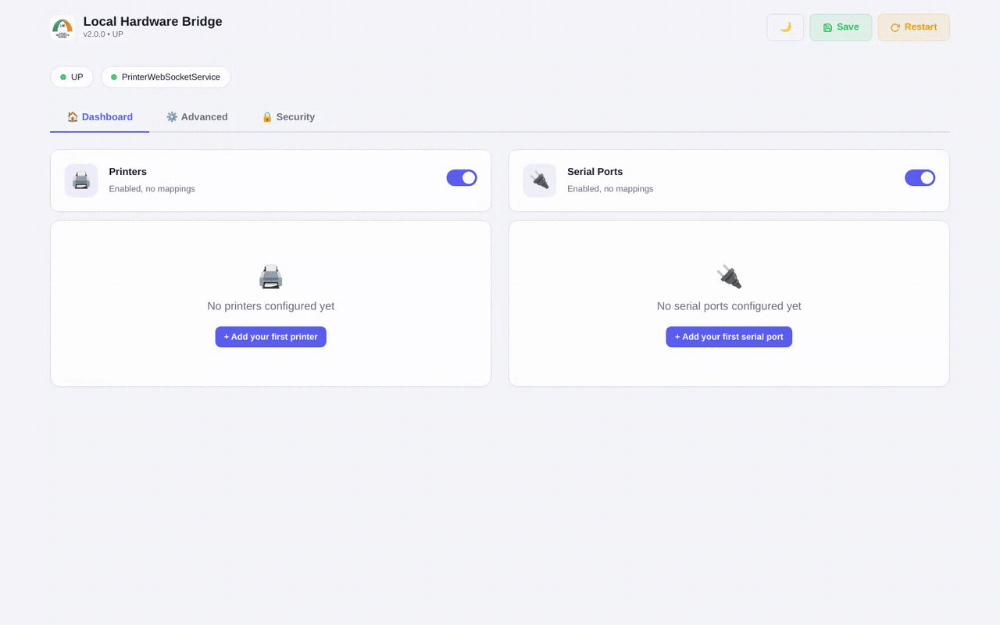
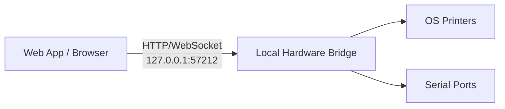
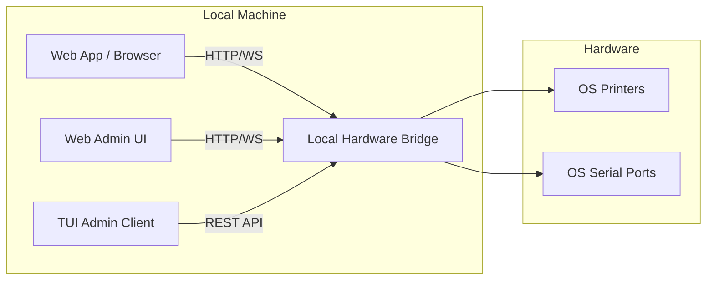

# Local Hardware Bridge

[](https://github.com/AugustinLR17/local-hardware-bridge/actions/workflows/ci.yml)
[](https://github.com/AugustinLR17/local-hardware-bridge/releases/latest)
[](https://github.com/AugustinLR17/local-hardware-bridge/releases)
[](LICENSE)
[](build.gradle)
[](https://signpath.org/)

<!-- SonarQube badges below point at a self-hosted instance (http://localhost:9001) and only
     render where that server is reachable. For public rendering on GitHub, host the analysis
     on SonarCloud and replace the URLs accordingly. -->
[](http://localhost:9001/dashboard?id=local-hardware-bridge)
[](http://localhost:9001/dashboard?id=local-hardware-bridge)

> **Fork of** [WebApp Hardware Bridge](https://github.com/imTigger/webapp-hardware-bridge) by imTigger — originally licensed under MIT.

**Local Hardware Bridge** exposes local printers and serial ports to a web browser running on the same machine. Built for POS systems, WMS, IoT dashboards, and any web app that needs silent access to local hardware without installing browser plugins or extensions.

The bridge runs locally (127.0.0.1 by default). A website or local web app opens in the browser and talks to the bridge via HTTP/WebSocket. The bridge then talks to the OS printers and serial ports.



> Screenshots and demo recordings are generated automatically — see [`scripts/capture/`](scripts/capture).

## Features

- **Silent Printing** — PDF, images, ESC/POS, ZPL from any browser or remote server
- **Serial Port I/O** — Bidirectional communication with scales, scanners, IoT devices
- **REST API** — Full CRUD for config, mappings, printer/serial management
- **WebSocket API** — Real-time streaming for serial data and print status
- **Web UI** — Browser-based configuration dashboard
- **TUI Admin** — Terminal dashboard for managing the bridge server (not for end users)
- **Cross-Platform** — Windows, Linux, macOS with native installers
- **Auth & TLS** — Bearer token authentication, HTTPS/WSS support

## Quick Start

### Download

Grab the latest release from [Releases](https://github.com/AugustinLR17/local-hardware-bridge/releases):

| Platform | File |
|----------|------|
| Cross-platform | `local-hardware-bridge-*.jar` (requires JDK 21+) |
| Windows | `Local-Hardware-Bridge-*.exe` (single installer, bundled Java, runs in background, auto-start) |
| Linux | `.AppImage` (requires JDK 21+) |
| macOS | `.dmg` installer |

> **Free code signing provided by [SignPath Foundation](https://signpath.org/)** — Windows binaries are Authenticode-signed at no cost courtesy of the SignPath open source program. Certificate issued by SignPath Foundation.

### Run

```bash
# GUI mode (system tray icon)
java -jar local-hardware-bridge-*.jar

# Server mode (headless)
java -cp local-hardware-bridge-*.jar io.github.augustinlr17.localhardwarebridge.Server

# TUI mode (terminal interface)
./lhb-tui --server http://127.0.0.1:57212
```

The Web UI is available at `http://127.0.0.1:57212` (default).

## Operating Modes

Local Hardware Bridge runs on the **same machine as the browser**. The local web app (or a website that the user opens locally) talks to the bridge, and the bridge talks to the hardware.



Use case: a cashier PC, a local POS, a warehouse workstation, or any desktop where the browser and the hardware are on the same machine.

### TUI Admin

The TUI is a terminal dashboard for the administrator of the bridge. It connects to a running bridge instance and is **not** used by end users. It is useful for headless setups or when you want to monitor the bridge without opening a browser.

```bash
./lhb-tui --server http://127.0.0.1:57212
```


## Architecture



**How it works:** The Java application runs a Javalin HTTP/WebSocket server on localhost. Printer and serial services subscribe to channels. Messages are routed between WebSocket clients, HTTP requests, and hardware services via a pub/sub channel model.

## REST API

Full API documentation: [HTTP API Reference](https://github.com/AugustinLR17/local-hardware-bridge/wiki/HTTP-API-Reference)

### Quick Reference

| Method | Endpoint | Description |
|--------|----------|-------------|
| **Config** | | |
| GET | `/config.json` | Get full configuration |
| PUT | `/config.json` | Update full configuration |
| GET | `/system/server.json` | Get server config |
| PUT | `/system/server.json` | Update server config |
| GET | `/system/downloader.json` | Get downloader config |
| PUT | `/system/downloader.json` | Update downloader config |
| GET | `/system/gui.json` | Get GUI config |
| PUT | `/system/gui.json` | Update GUI config |
| **Printer** | | |
| GET | `/system/printers.json` | List OS printers |
| GET | `/printer/mappings` | List printer mappings |
| POST | `/printer/mappings` | Add printer mapping |
| PUT | `/printer/mappings/{type}` | Update printer mapping |
| DELETE | `/printer/mappings/{type}` | Delete printer mapping |
| PUT | `/printer/enabled` | Enable/disable printer service |
| POST | `/printer` | Submit print job |
| **Serial** | | |
| GET | `/system/serials.json` | List OS serial ports |
| GET | `/serial/mappings` | List serial mappings |
| POST | `/serial/mappings` | Add serial mapping |
| PUT | `/serial/mappings/{type}` | Update serial mapping |
| DELETE | `/serial/mappings/{type}` | Delete serial mapping |
| PUT | `/serial/enabled` | Enable/disable serial service |
| GET | `/serial/status` | Serial port status (open/mapped) |
| GET | `/serial/connections` | WebSocket clients per channel |
| POST | `/serial/{type}` | Write to serial port |
| **System** | | |
| GET | `/system/version.json` | App name, ID, version |
| GET | `/system/health` | Health check + services + connections |
| GET | `/system/connections` | All WebSocket connections |
| POST | `/system/notification` | Send desktop notification |
| POST | `/system/restart.json` | Restart server |
| POST | `/system/install-service` | Install systemd service (Linux) |
| POST | `/system/uninstall-service` | Uninstall systemd service (Linux) |
| GET | `/system/update/status` | Get update check status |
| GET | `/system/update/check` | Check for updates (synchronous) |
| POST | `/system/update/download` | Download the update JAR |
| POST | `/system/update/apply` | Apply pending update and restart |
| POST | `/system/update/rollback` | Rollback to previous version |
| GET | `/system/update.json` | Get update config section |
| PUT | `/system/update.json` | Update update config section |

### Example: Print from command line

```bash
# List available printers
curl http://127.0.0.1:57212/system/printers.json

# Print a PDF from URL
curl -X POST http://127.0.0.1:57212/printer \
  -H "Content-Type: application/json" \
  -d '{"type":"INVOICE","url":"https://example.com/invoice.pdf"}'

# Print raw ESC/POS data
curl -X POST http://127.0.0.1:57212/printer \
  -H "Content-Type: application/json" \
  -d '{"type":"RECEIPT","raw_content":"<base64-encoded-data>"}'

# Add a printer mapping
curl -X POST http://127.0.0.1:57212/printer/mappings \
  -H "Content-Type: application/json" \
  -d '{"type":"RECEIPT","name":"POS-80"}'

# Check health
curl http://127.0.0.1:57212/system/health
```

### Example: Serial port management

```bash
# List serial ports
curl http://127.0.0.1:57212/system/serials.json

# Add a serial mapping
curl -X POST http://127.0.0.1:57212/serial/mappings \
  -H "Content-Type: application/json" \
  -d '{"type":"SCALE","name":"/dev/ttyUSB0","baudRate":9600,"numDataBits":8,"numStopBits":1,"parity":0}'

# Write to serial port
curl -X POST http://127.0.0.1:57212/serial/SCALE \
  -H "Content-Type: text/plain" \
  -d 'W'

# Check serial port status
curl http://127.0.0.1:57212/serial/status
```

## WebSocket Protocol

### Printer Channel (`/printer`)

Send:
```json
{
  "type": "receipt",
  "url": "https://example.com/receipt.pdf",
  "id": "optional-id",
  "qty": 1,
  "file_content": "base64-encoded-file",
  "raw_content": "base64-encoded-raw-escpos",
  "extras": [{"text": "annotation", "x": 10.0, "y": 20.0, "size": 12, "bold": true}]
}
```

Receive `PrintResult`:
```json
{"success": true, "message": "Success", "id": "...", "printerName": "..."}
```

### Serial Channel (`/serial/{type}`)

- Text messages → written to serial port
- Binary messages → written as raw bytes
- Data from serial port → sent back as text (or binary if `readCharset` is `"BINARY"`)

## Cross-Platform

| Platform | GUI Mode | Server Mode | Install | Service |
|----------|----------|-------------|---------|---------|
| Windows | System tray, `.exe` | `java -cp ... Server` | Single `.exe` installer | HKCU auto-start (registered by installer) |
| Linux | Headless fallback | `java -cp ... Server` | `.AppImage` | systemd |
| macOS | Headless fallback | `java -cp ... Server` | `.dmg` | launchd |

## Security

Each REST endpoint can be individually disabled or protected with its own password. This lets you lock down sensitive endpoints (`/printer`, `/system/restart.json`, etc.) while leaving public ones (`/system/health`) open.

Configure endpoint security in the Web UI under **Advanced → Endpoint Security** or by editing `config.json`:

```json
{
  "security": {
    "endpoints": {
      "/printer": { "enabled": true, "password": "print-password" },
      "/system/restart.json": { "enabled": false, "password": null }
    }
  }
}
```

- `enabled: false` → the endpoint returns `403 Forbidden`.
- `password` set → endpoint requires `Authorization: Bearer <password>` or Basic Auth password.
- Empty `password` with `enabled: true` → endpoint follows the global auth setting (if any).

You can also enable global Bearer/Basic auth under **Advanced → Server → Authentication**.

## Auto-Update

The bridge can check for new versions on GitHub Releases and optionally download and install them automatically. This is an **opt-in hybrid approach** (detection + notification + manual install by default) designed for B2B/POS environments where operators want control over when updates happen.

### How it works

1. **Check** — polls the GitHub Releases API for the latest version, comparing it with `Constants.VERSION` using semver rules
2. **Download** — if a newer version is found, downloads the new fat JAR to `updates/` (atomic: writes to `.part`, moves when complete)
3. **Apply** — replaces the current JAR (backs up the old one to `.bak`), then restarts the server
4. **Rollback** — if the new version fails, `POST /system/update/rollback` restores the `.bak`

### Config

```json
{
  "update": {
    "enabled": true,
    "autoDownload": false,
    "autoInstall": false,
    "includePrereleases": false,
    "checkIntervalHours": 24,
    "repository": "AugustinLR17/local-hardware-bridge",
    "channel": "stable"
  }
}
```

| Option | Default | Description |
|--------|---------|-------------|
| `enabled` | `true` | Master switch for update checks |
| `autoDownload` | `false` | Download the JAR automatically when an update is detected (no install) |
| `autoInstall` | `false` | Apply the downloaded update on the next restart (implies autoDownload) |
| `includePrereleases` | `false` | Include alpha/beta/RC versions in checks |
| `checkIntervalHours` | `24` | Check interval in hours. `0` = startup-only |
| `repository` | `"AugustinLR17/local-hardware-bridge"` | GitHub repo to check |
| `channel` | `"stable"` | `"stable"` or `"prerelease"` |

### Manual update via REST API

```bash
# Check for updates
curl http://127.0.0.1:57212/system/update/check

# Download the update JAR
curl -X POST http://127.0.0.1:57212/system/update/download

# Apply and restart
curl -X POST http://127.0.0.1:57212/system/update/apply

# Rollback if something goes wrong
curl -X POST http://127.0.0.1:57212/system/update/rollback
```

### Emergency bypass

If a bad auto-update prevents startup, pass `-Dlhb.no-update=true` to skip the auto-apply logic:
```bash
java -Dlhb.no-update=true -jar local-hardware-bridge.jar
```

The Web UI has an **Auto-Update** card under the Advanced tab, and the system tray menu has a **Check for Updates** item.

## Documentation

Full documentation lives in the [GitHub Wiki](https://github.com/AugustinLR17/local-hardware-bridge/wiki).

| Wiki Page | Description |
|-----------|-------------|
| [Getting Started](https://github.com/AugustinLR17/local-hardware-bridge/wiki/Getting-Started) | Install and print in 5 minutes |
| [Installation](https://github.com/AugustinLR17/local-hardware-bridge/wiki/Installation) | Per-platform setup |
| [Configuration Reference](https://github.com/AugustinLR17/local-hardware-bridge/wiki/Configuration-Reference) | All config options explained |
| [HTTP API Reference](https://github.com/AugustinLR17/local-hardware-bridge/wiki/HTTP-API-Reference) | Complete REST API docs |
| [WebSocket Protocol](https://github.com/AugustinLR17/local-hardware-bridge/wiki/WebSocket-Protocol) | Real-time channels |
| [Browser Integration](https://github.com/AugustinLR17/local-hardware-bridge/wiki/Browser-Integration) | JS SDK & framework examples |
| [Security and Hardening](https://github.com/AugustinLR17/local-hardware-bridge/wiki/Security-and-Hardening) | Auth, TLS, SSRF, CORS |
| [Deployment Guides](https://github.com/AugustinLR17/local-hardware-bridge/wiki/Deployment-Guides) | systemd, launchd, auto-start |
| [Auto-Update](https://github.com/AugustinLR17/local-hardware-bridge/wiki/Auto-Update) | Automatic update checking, downloading, and rollback |
| [Architecture](https://github.com/AugustinLR17/local-hardware-bridge/wiki/Architecture) | Internal design |
| [Development Guide](https://github.com/AugustinLR17/local-hardware-bridge/wiki/Development-Guide) | Build, test, contribute |
| [Troubleshooting](https://github.com/AugustinLR17/local-hardware-bridge/wiki/Troubleshooting) | Common issues and fixes |
| [FAQ](https://github.com/AugustinLR17/local-hardware-bridge/wiki/FAQ) | Frequently asked questions |

## Browser Integration

There is no bundled SDK package. Web apps talk to the bridge directly over the
raw HTTP/WebSocket API documented above. The [`demo/`](demo) directory contains
small, dependency-free JavaScript helper clients you can copy into your app, plus
runnable HTML examples.

### Helper clients (in `demo/`)

| File | Global | Purpose |
|------|--------|---------|
| [`websocket-printer.js`](demo/websocket-printer.js) | `WebSocketPrinter` | Connects to `/printer`, submits print jobs, reports status via callbacks |
| [`websocket-serial.js`](demo/websocket-serial.js) | `WebSocketSerial` | Connects to `/serial/{type}`, sends/receives raw serial data |
| [`websocket-weigh.js`](demo/websocket-weigh.js) | `WebSocketWeigh` | Connects to `/serial/WEIGH`, parses weight scale output (regex-based) |

Each is a plain constructor function with auto-reconnect — no build step, no
package manager. Include the file with a `<script>` tag and instantiate it.

### Example: submit a print job

```html
<script src="websocket-printer.js"></script>
<script>
const printer = new WebSocketPrinter({
  url: 'ws://127.0.0.1:57212/printer',
  onConnect: () => console.log('connected'),
  onUpdate: (result) => console.log('print result:', result),
});

// result objects are PrintResult JSON: {success, message, id, printerName}
printer.submit({ type: 'INVOICE', url: 'https://example.com/invoice.pdf' });
</script>
```

### Example: read a weight scale

```html
<script src="websocket-weigh.js"></script>
<script>
new WebSocketWeigh({
  url: 'ws://127.0.0.1:57212/serial/WEIGH',
  onUpdate: (weight, stable) => {
    console.log(`weight: ${weight} kg, stable: ${stable}`);
  },
});
</script>
```

### Runnable HTML demos

The `demo/` directory also has ready-to-open HTML pages:
`printer-basic.htm`, `printer-advanced.htm`, `printer-annotation.htm`,
`serial-basic.html`, and `serial-weigh.htm`.

Prefer plain HTTP instead of WebSocket? `POST /printer` accepts the same job
payload and returns the `PrintResult` synchronously — see the REST API above.

## License

MIT License — see [LICENSE](LICENSE)

Original work Copyright (c) 2017 imTigger
Modified work Copyright (c) 2026 AugustinLR17
