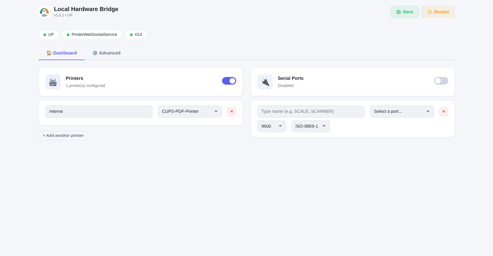
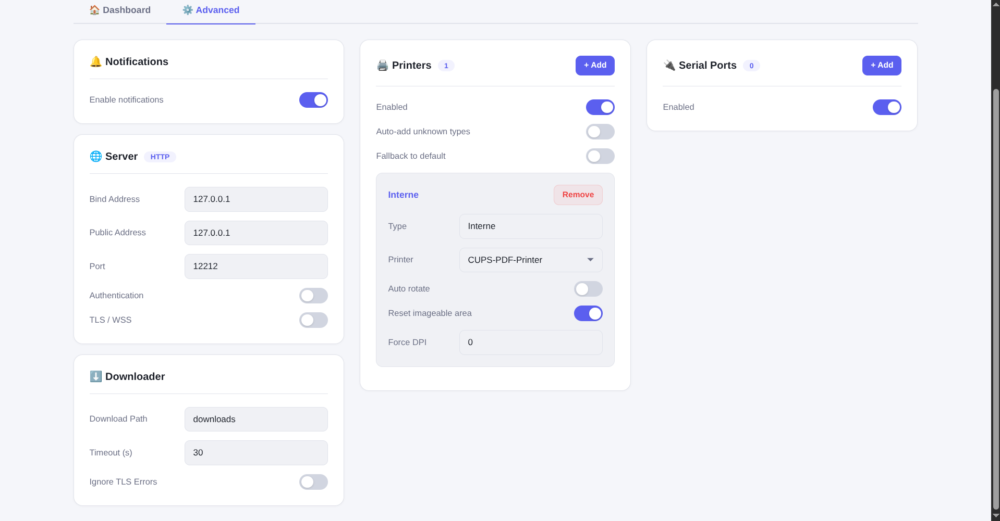
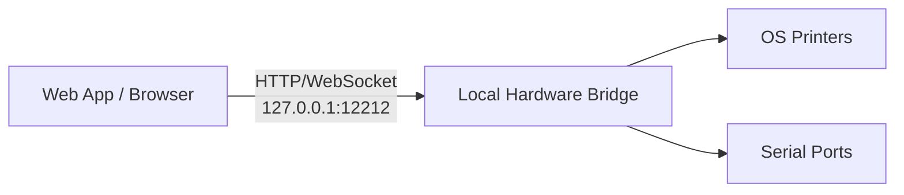
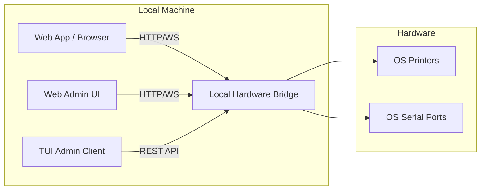
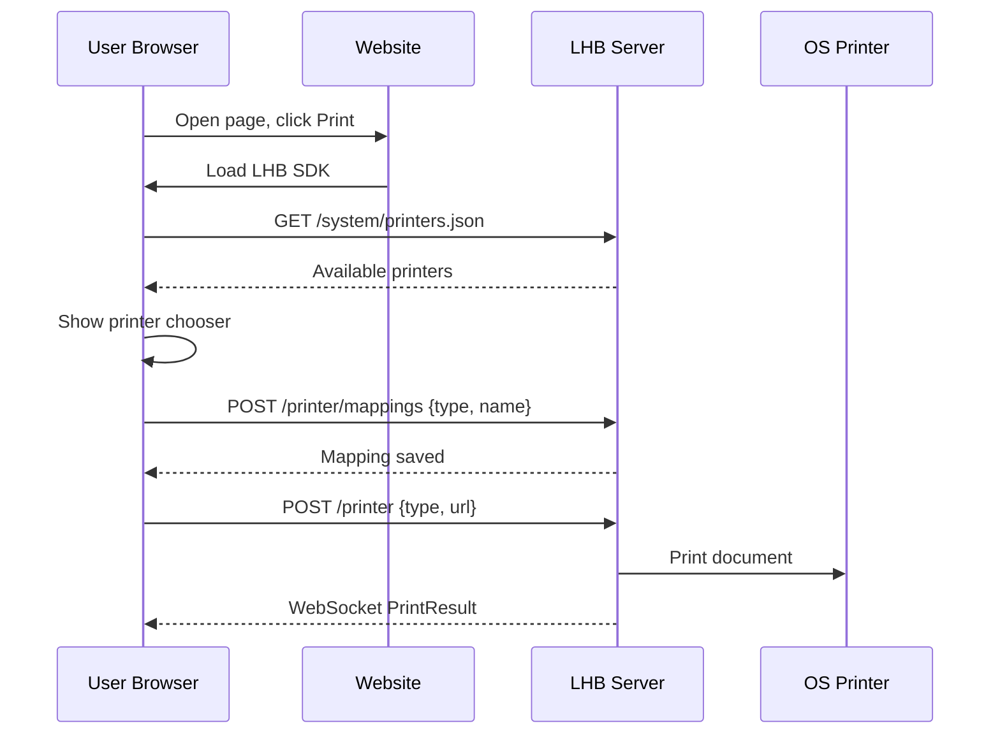

# Local Hardware Bridge

> **Fork of** [WebApp Hardware Bridge](https://github.com/imTigger/webapp-hardware-bridge) by imTigger — originally licensed under MIT.

**Local Hardware Bridge** exposes local printers and serial ports to a web browser running on the same machine. Built for POS systems, WMS, IoT dashboards, and any web app that needs silent access to local hardware without installing browser plugins or extensions.

The bridge runs locally (127.0.0.1 by default). A website or local web app opens in the browser and talks to the bridge via HTTP/WebSocket. The bridge then talks to the OS printers and serial ports.

## Features

- **Silent Printing** — PDF, images, ESC/POS, ZPL from any browser or remote server
- **Serial Port I/O** — Bidirectional communication with scales, scanners, IoT devices
- **REST API** — Full CRUD for config, mappings, printer/serial management
- **WebSocket API** — Real-time streaming for serial data and print status
- **Web UI** — Browser-based configuration dashboard
- **TUI Admin** — Terminal dashboard for managing the bridge server (not for end users)
- **Cross-Platform** — Windows, Linux, macOS with native installers
- **Auth & TLS** — Bearer token authentication, HTTPS/WSS support

## Quick Start

### Download

Grab the latest release from [Releases](https://github.com/AugustinLR17/local-hardware-bridge/releases):

| Platform | File |
|----------|------|
| Cross-platform | `local-hardware-bridge-*.jar` (requires JDK 21+) |
| Windows | `Local-Hardware-Bridge-*.exe` (single installer, bundled Java, runs in background, auto-start) |
| Linux | `.AppImage` (requires JDK 21+) |
| macOS | `.dmg` installer |

### Run

```bash
# GUI mode (system tray icon)
java -jar local-hardware-bridge-*.jar

# Server mode (headless)
java -cp local-hardware-bridge-*.jar io.github.augustinlr17.localhardwarebridge.Server

# TUI mode (terminal interface)
./lhb-tui --server http://127.0.0.1:12212
```

The Web UI is available at `http://127.0.0.1:12212` (default).




## Operating Modes

Local Hardware Bridge runs on the **same machine as the browser**. The local web app (or a website that the user opens locally) talks to the bridge, and the bridge talks to the hardware.



Use case: a cashier PC, a local POS, a warehouse workstation, or any desktop where the browser and the hardware are on the same machine.

### TUI Admin

The TUI is a terminal dashboard for the administrator of the bridge. It connects to a running bridge instance and is **not** used by end users. It is useful for headless setups or when you want to monitor the bridge without opening a browser.

```bash
./lhb-tui --server http://127.0.0.1:12212
```

## Architecture



**How it works:** The Java application runs a Javalin HTTP/WebSocket server on localhost. Printer and serial services subscribe to channels. Messages are routed between WebSocket clients, HTTP requests, and hardware services via a pub/sub channel model.

## REST API

Full API documentation: [HTTP_API.md](HTTP_API.md)

### Quick Reference

| Method | Endpoint | Description |
|--------|----------|-------------|
| **Config** | | |
| GET | `/config.json` | Get full configuration |
| PUT | `/config.json` | Update full configuration |
| GET | `/system/server.json` | Get server config |
| PUT | `/system/server.json` | Update server config |
| GET | `/system/downloader.json` | Get downloader config |
| PUT | `/system/downloader.json` | Update downloader config |
| GET | `/system/gui.json` | Get GUI config |
| PUT | `/system/gui.json` | Update GUI config |
| **Printer** | | |
| GET | `/system/printers.json` | List OS printers |
| GET | `/printer/mappings` | List printer mappings |
| POST | `/printer/mappings` | Add printer mapping |
| PUT | `/printer/mappings/{type}` | Update printer mapping |
| DELETE | `/printer/mappings/{type}` | Delete printer mapping |
| PUT | `/printer/enabled` | Enable/disable printer service |
| POST | `/printer` | Submit print job |
| **Serial** | | |
| GET | `/system/serials.json` | List OS serial ports |
| GET | `/serial/mappings` | List serial mappings |
| POST | `/serial/mappings` | Add serial mapping |
| PUT | `/serial/mappings/{type}` | Update serial mapping |
| DELETE | `/serial/mappings/{type}` | Delete serial mapping |
| PUT | `/serial/enabled` | Enable/disable serial service |
| GET | `/serial/status` | Serial port status (open/mapped) |
| GET | `/serial/connections` | WebSocket clients per channel |
| POST | `/serial/{type}` | Write to serial port |
| **System** | | |
| GET | `/system/version.json` | App name, ID, version |
| GET | `/system/health` | Health check + services + connections |
| GET | `/system/connections` | All WebSocket connections |
| POST | `/system/notification` | Send desktop notification |
| POST | `/system/restart.json` | Restart server |
| POST | `/system/install-service` | Install systemd service (Linux) |
| POST | `/system/uninstall-service` | Uninstall systemd service (Linux) |

### Example: Print from command line

```bash
# List available printers
curl http://127.0.0.1:12212/system/printers.json

# Print a PDF from URL
curl -X POST http://127.0.0.1:12212/printer \
  -H "Content-Type: application/json" \
  -d '{"type":"INVOICE","url":"https://example.com/invoice.pdf"}'

# Print raw ESC/POS data
curl -X POST http://127.0.0.1:12212/printer \
  -H "Content-Type: application/json" \
  -d '{"type":"RECEIPT","raw_content":"<base64-encoded-data>"}'

# Add a printer mapping
curl -X POST http://127.0.0.1:12212/printer/mappings \
  -H "Content-Type: application/json" \
  -d '{"type":"RECEIPT","name":"POS-80"}'

# Check health
curl http://127.0.0.1:12212/system/health
```

### Example: Serial port management

```bash
# List serial ports
curl http://127.0.0.1:12212/system/serials.json

# Add a serial mapping
curl -X POST http://127.0.0.1:12212/serial/mappings \
  -H "Content-Type: application/json" \
  -d '{"type":"SCALE","name":"/dev/ttyUSB0","baudRate":9600,"numDataBits":8,"numStopBits":1,"parity":0}'

# Write to serial port
curl -X POST http://127.0.0.1:12212/serial/SCALE \
  -H "Content-Type: text/plain" \
  -d 'W'

# Check serial port status
curl http://127.0.0.1:12212/serial/status
```

## WebSocket Protocol

### Printer Channel (`/printer`)

Send:
```json
{
  "type": "receipt",
  "url": "https://example.com/receipt.pdf",
  "id": "optional-id",
  "qty": 1,
  "file_content": "base64-encoded-file",
  "raw_content": "base64-encoded-raw-escpos",
  "extras": [{"text": "annotation", "x": 10.0, "y": 20.0, "size": 12, "bold": true}]
}
```

Receive `PrintResult`:
```json
{"success": true, "message": "Success", "id": "...", "printerName": "..."}
```

### Serial Channel (`/serial/{type}`)

- Text messages → written to serial port
- Binary messages → written as raw bytes
- Data from serial port → sent back as text (or binary if `readCharset` is `"BINARY"`)

## Cross-Platform

| Platform | GUI Mode | Server Mode | Install | Service |
|----------|----------|-------------|---------|---------|
| Windows | System tray, `.exe` | `java -cp ... Server` | Single `.exe` installer | HKCU auto-start (registered by installer) |
| Linux | Headless fallback | `java -cp ... Server` | `.AppImage` | systemd |
| macOS | Headless fallback | `java -cp ... Server` | `.dmg` | launchd |

## Security

Each REST endpoint can be individually disabled or protected with its own password. This lets you lock down sensitive endpoints (`/printer`, `/system/restart.json`, etc.) while leaving public ones (`/system/health`) open.

Configure endpoint security in the Web UI under **Advanced → Endpoint Security** or by editing `config.json`:

```json
{
  "security": {
    "endpoints": {
      "/printer": { "enabled": true, "password": "print-password" },
      "/system/restart.json": { "enabled": false, "password": null }
    }
  }
}
```

- `enabled: false` → the endpoint returns `403 Forbidden`.
- `password` set → endpoint requires `Authorization: Bearer <password>` or Basic Auth password.
- Empty `password` with `enabled: true` → endpoint follows the global auth setting (if any).

You can also enable global Bearer/Basic auth under **Advanced → Server → Authentication**.

## Documentation

| Document | Description |
|----------|-------------|
| [HTTP API Reference](HTTP_API.md) | Complete REST & WebSocket API docs |
| [Configuration](CONFIGURATION.md) | All config options explained |
| [Advanced](ADVANCED.md) | Auth, TLS/WSS, advanced settings |
| [Build Instructions](BUILD.md) | Build from source, create installers |
| [Troubleshooting](TROUBLESHOOT.md) | Common issues and fixes |
| [Architecture](ARCHITECTURE.md) | Internal architecture and design |
| [Changelog](CHANGELOG.md) | Version history |

## Server Mode Integration

For **Server Mode**, include the SDK on your public website and use it from the user's browser. The bridge does not need to be installed on the user's machine; it runs on a machine on the network with printer access.

### SDK API

| Method | Description |
|----------|-------------|
| `LHB.listPrinters(serverUrl)` | List printers available on the bridge machine |
| `LHB.listMappings(serverUrl)` | List configured type → printer mappings |
| `LHB.choosePrinter(serverUrl, type, printerName)` | Persist a type → printer mapping on the bridge |
| `LHB.print(serverUrl, document)` | Submit a print job |
| `LHB.connect(serverUrl, callbacks)` | WebSocket for live print status |
| `LHB.ensurePrinter(serverUrl, type, token, {prompt})` | Auto-map or prompt the user to choose a printer |

### Example

```html
<script src="https://your-cdn.com/local-hardware-bridge/printer-sdk.js"></script>
<script>
const serverUrl = 'http://192.168.1.100:12212';
const documentType = 'INVOICE';

async function printInvoice(pdfUrl) {
  // Make sure the user has chosen a printer for this type
  await LHB.ensurePrinter(serverUrl, documentType, null, {
    prompt: async (printers) => {
      const names = printers.map(p => p.name);
      const chosen = await showPrinterDialog(names); // your UI
      return chosen;
    }
  });

  // Submit the print job
  await LHB.print(serverUrl, { type: documentType, url: pdfUrl });
}
</script>
```

The chosen printer is persisted both in the bridge config (`/printer/mappings`) and in the browser's `localStorage`, so the next print job can skip the dialog.

### Workflow



## JS SDK

Integration examples for web apps are in the [`demo/`](demo) directory:

- [`websocket-printer.js`](demo/websocket-printer.js) — Printer WebSocket client
- [`websocket-serial.js`](demo/websocket-serial.js) — Serial WebSocket client
- [`websocket-weigh.js`](demo/websocket-weigh.js) — Weight scale client (AWH-SA30)

## License

MIT License — see [LICENSE](LICENSE)

Original work Copyright (c) 2017 imTigger
Modified work Copyright (c) 2026 AugustinLR17
